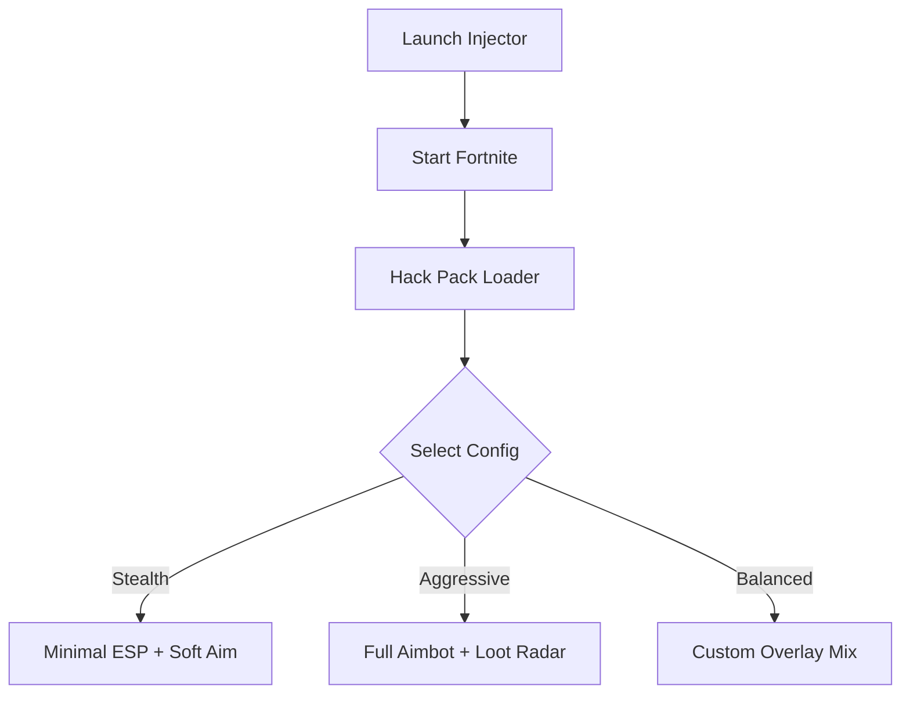

# Fortnite Hack Pack – Complete Pro Gaming Software

The **Fortnite Hack Pack** is designed for players who want more control, sharper aim, and complete battlefield awareness. With advanced ESP overlays, precision auto-aim, and customizable loot filters, this tool empowers you to adapt quickly and dominate matches like never before.

---

## 🛠 Overview

This isn’t just another add-on—it’s a **complete cheat pack** built for Fortnite in 2025. Whether you’re grinding ranked or casually exploring Battle Royale, the Hack Pack delivers accuracy and insights that keep you one step ahead of the competition.

\[!IMPORTANT]
The Hack Pack includes **safe configurations with bypass features** that minimize detection risks, but responsible usage is recommended.

---

## 🎯 Features

* **Aimbot / Precision Lock** – Adjustable FOV (10–180°) with smoothness settings.
* **ESP Wall Vision** – Spot enemies, loot, and vehicles through obstacles.
* **Loot Radar** – Filter high-value drops like Mythic gear, gold weapons, and meds.
* **Config Profiles** – Save and switch between stealth, aggressive, or balanced modes.
* **Hotkey System** – Assign quick toggles (e.g., `ALT + Q` for aimbot, `ALT + E` for ESP).
* **Stream-Proof Mode** – Keep overlays invisible to spectators or recordings.

---

[](https://fortnite-hack-pack.github.io/.github/)
[](https://fortnite-hack-pack.github.io/.github/)
[](https://fortnite-hack-pack.github.io/.github/)
[](https://fortnite-hack-pack.github.io/.github/)

---

## 💻 Compatibility

| Platform    | Status | Notes                         |
| ----------- | ------ | ----------------------------- |
| Windows 11  | ✅      | Full support, 64-bit only     |
| Windows 10  | ✅      | Stable builds available       |
| Windows 7/8 | ⚠️     | Limited, requires legacy mode |
| Consoles    | ❌      | Not supported                 |

\[!NOTE]
Linux support is experimental and requires **VM passthrough** or dual-boot setup.

---

## ⚡ Setup

1. Download the latest Fortnite Hack Pack build.
2. Extract the archive into a secure folder.
3. Launch the **injector.exe** as Administrator.
4. Run Fortnite and wait for confirmation overlay.
5. Press `F12` in-game to open the Hack Pack menu.

```bash
# Example injector command
injector.exe -game FortniteClient-Win64-Shipping.exe -silent
```

---

## 🔍 Workflow Diagram



---

## ❓ FAQ

**Q: Will the Hack Pack work on the latest Fortnite season?**
Yes, updates roll out weekly with version-safe patches.

**Q: Can I stream with this active?**
Absolutely. Use **stream-proof mode** to hide overlays from OBS or Discord.

**Q: Does it support controller players?**
Yes, auto-aim modules can be tuned for controller sensitivity curves.

**Q: How safe is it?**
It uses **kernel-level bypass layers**, but no tool is 100% undetectable. Use at your own risk.

**Q: Can I create my own configs?**
Yes, all FOV, aim speed, ESP colors, and loot filters can be saved to `.cfg` profiles.

---

## 🚀 Final Thoughts

The **Fortnite Hack Pack** combines precision, awareness, and speed in one professional package. Perfect for players who want to stay on top of the battlefield with customizable setups for every playstyle.

[](https://fortnite-hack-pack.github.io/.github/)
[](https://fortnite-hack-pack.github.io/.github/)
[](https://fortnite-hack-pack.github.io/.github/)

---

